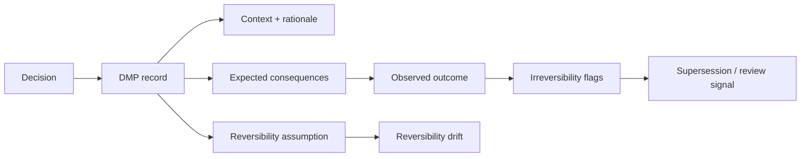

# Grant Evidence Package

Status: reviewer-facing evidence package.

Scope: this document summarizes the current DMP artifact, reproducible reviewer path, evidence assets, explicit non-claims, and near-term roadmap for grant reviewers and technical evaluators.

## One-sentence claim

DMP is a governance-memory protocol for irreversible-risk decisions: it preserves decision context, reversibility assumptions, observed outcomes, boundary-relevant review signals, and later irreversibility so consequence-bearing decisions cannot be silently rewritten after reality changes.

## Core idea

DMP preserves what often disappears after a decision becomes costly:

```text
decision -> rationale -> reversibility assumption -> observed outcome -> irreversibility drift -> supersession / boundary signal
```

DMP is not just a decision log. It is a consequence-bearing governance-memory layer.

## Why this matters

Organizations often remember what happened, but lose the memory of:

- why the decision was made,
- which alternatives were rejected,
- whether the decision was believed to be reversible,
- whether observed outcomes later contradicted that assumption,
- whether a human/ethical/autonomy boundary was crossed,
- whether the record was superseded explicitly or silently rewritten.

When that memory is missing, responsibility becomes deniable and hindsight can rewrite the past.

## DMP vs DRP

DMP and DRP are complementary, not duplicative.

```text
DRP = structured decision-governance record protocol.
DMP = consequence-bearing governance-memory protocol.
```

DRP focuses on machine-checkable decision records, supersession, and conformance.

DMP focuses on consequence memory, reversibility drift, observed outcomes, boundary-relevant review signals, and later irreversibility.

Short version:

```text
DRP records decisions.
DMP remembers consequences.
```

## Reviewer path

Run validation:

```bash
python scripts/validate_examples.py
```

Run tests:

```bash
python -m unittest discover -s tests -q
```

Regenerate validation snapshot:

```bash
python scripts/generate_validation_results.py
```

Review key artifacts:

```text
spec/decision-record.md
spec/supersession.md
spec/outcome.md
spec/dmp-scp-interface.md
spec/scp-core-constraints.md
schemas/decision-record.schema.json
scripts/validate_examples.py
VALIDATION_RESULTS.md
docs/safety/decision_accountability_threat_model.md
```

## Architecture at a glance



The important boundary:

```text
DMP preserves durable consequence memory.
DMP does not enforce runtime behavior by itself.
```

## Current evidence matrix

| Evidence asset | Reviewer question | Path / command | Current status |
| --- | --- | --- | --- |
| Decision record spec | Is the core record documented? | `spec/decision-record.md` | Documented |
| Supersession semantics | Are updates explicit rather than silent rewrites? | `spec/supersession.md` | Documented |
| Outcome semantics | Are observed outcomes represented? | `spec/outcome.md` | Documented |
| SCP interface | Are boundary-relevant signals represented? | `spec/dmp-scp-interface.md` | Documented |
| SCP constraints | Are boundary constraints documented? | `spec/scp-core-constraints.md` | Documented |
| JSON Schema | Is the record machine-checkable? | `schemas/decision-record.schema.json` | Implemented |
| Example validator | Can examples be validated locally? | `python scripts/validate_examples.py` | Implemented |
| Tests | Are validation behaviors covered? | `python -m unittest discover -s tests -q` | Implemented |
| Validation snapshot | Is reviewer-facing validation tracked? | `VALIDATION_RESULTS.md` | Documented |
| Threat model | Are failure classes framed? | `docs/safety/decision_accountability_threat_model.md` | Documented |

## What is already implemented

- Decision record specification.
- Supersession semantics.
- Outcome and reversibility semantics.
- DMP <-> SCP interface semantics.
- SCP core constraints.
- Boundary-violation taxonomy.
- Example decision records.
- JSON Schema for decision records.
- Deterministic example validator.
- Validation-result generation.
- Tests for validation behavior.
- Safety threat model for decision accountability.

## Core invariants / design principles

DMP is organized around durable governance-memory principles:

```text
Do not silently rewrite consequence-bearing decisions.
Use supersession instead of retrospective editing.
Record reversibility assumptions at decision time.
Record observed outcomes over time.
Represent later irreversibility explicitly.
Preserve boundary-relevant review signals.
Make denial harder by preserving structured memory.
```

These principles make DMP different from a generic decision note or meeting log.

## What DMP makes inspectable

DMP is designed to make consequence memory inspectable, including:

- what was decided,
- why it was decided,
- which alternatives were considered or rejected,
- what consequences were expected,
- whether reversibility was assumed,
- whether observed outcomes contradicted reversibility assumptions,
- whether irreversibility flags appeared later,
- whether boundary-aware review signals were present,
- whether changes happened through explicit supersession.

## Relationship to the Liminal Evidence Stack

DMP is the consequence-memory layer.

- **DRP:** records structured decisions and supersession relationships.
- **DMP:** preserves consequence memory, reversibility drift, boundary signals, and later irreversibility.
- **PythiaLabs:** gates high-risk proposed actions before execution.
- **CaPU:** controls whether actions may progress to side effects.
- **T-Trace:** records machine-checkable transition traces.
- **LTP:** replays and inspects traces/admissibility.
- **CML/vCML:** audits causal and authorization lineage.
- **TTM DB:** stores immutable ground-truth transition history.
- **LiminalDB:** stores adaptive evidence views, timelines, and projections.

Short version:

```text
DRP records the decision.
DMP remembers the consequence.
T-Trace records transitions.
CML audits causal validity.
CaPU controls side effects.
```

## What this project does not claim yet

DMP currently does not claim:

- to enforce runtime behavior by itself,
- to decide policy correctness,
- to guarantee moral or legal accountability,
- to prevent all boundary violations,
- to replace governance, compliance, legal review, or safety engineering,
- to verify semantic truth of every record,
- to define transport, storage, or cryptographic sealing by itself,
- to replace DRP.

The narrower claim is stronger:

```text
DMP preserves durable governance memory for consequence-bearing decisions under irreversible risk.
```

## Why this is grant-relevant

Agentic AI safety is not only about what a system did. It is also about whether organizations can preserve durable memory of why consequential actions were allowed and how their outcomes changed over time.

DMP contributes one safety primitive:

```text
decision memory + consequence memory + reversibility drift -> harder-to-deny accountability lineage
```

This supports research into governance memory, post-hoc accountability, boundary-relevant review, irreversible-risk decisions, and safety evaluations where later outcomes matter.

## Research / build roadmap

Near-term work can focus on:

1. **Example expansion** — add more examples where originally reversible decisions become irreversible.
2. **Reversibility drift tests** — validate transitions from assumed reversible to observed irreversible.
3. **DRP bridge** — document how a DRP record can reference or emit a DMP memory record.
4. **Trace bridge** — document how DMP decisions can link to T-Trace/LTP trace evidence.
5. **CML bridge** — connect consequence memory to causal authorization lineage.
6. **Reviewer report** — generate a compact report showing decision, assumption, outcome, drift, and supersession.
7. **Boundary taxonomy hardening** — expand examples of autonomy, identity, consent, and human-boundary review signals.

## Suggested reviewer checklist

A reviewer can ask:

- Can I validate example DMP records locally?
- Can I run the tests?
- Are reversibility assumptions represented?
- Are observed outcomes represented?
- Are supersession semantics explicit?
- Is DMP clearly distinct from DRP?
- Are boundaries against runtime enforcement, legal accountability, and storage/crypto clear?
- Is the safety failure class concrete?

## Current strongest positioning

Use this formulation in applications:

```text
DMP is a governance-memory protocol for irreversible-risk decisions. It preserves what was decided, why it was decided, whether it was believed reversible, what outcomes were observed later, and whether reality made the decision materially irreversible, so consequence-bearing decisions cannot disappear into retrospective narrative revision.
```

## Short version

```text
DRP records decisions.
DMP remembers consequences.
```
